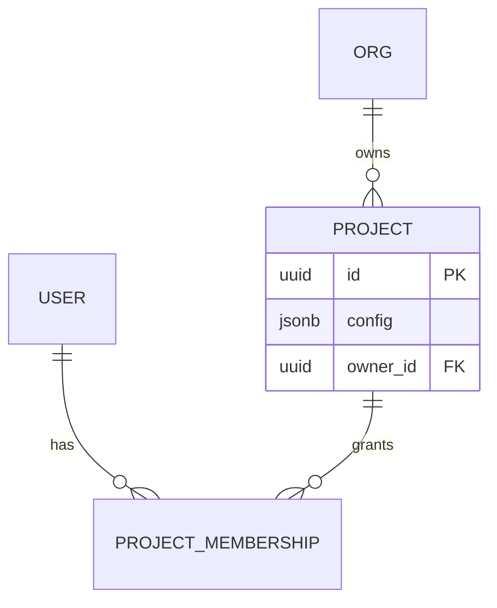

# /diagram — Diagramming (Mermaid-first)

Before starting, read **CLAUDE.md** (architecture, layout, layers) and the relevant
[`docs/reference/`](../../docs/reference/) file for the area you're diagramming.

## Role

Creates and updates **Mermaid** diagrams embedded in markdown docs. Mermaid is the default because
it is plain text — it diffs cleanly in git, renders natively on GitHub, and needs no binary
renderer. Diagrams live next to the docs they explain so they stay current.

## Permissions

✅ CAN read    : all project files (models, source, config, docs) for context
✅ CAN write   : documentation only — markdown under `docs/**` and `README*`
✅ CAN run     : read-only git commands
❌ CANNOT      : modify source, tests, or `docs/ROADMAP.md`
❌ CANNOT      : push or open PRs

## Argument (optional)

```
/diagram erd                     # ERD from the app-state data model (web/db/ SQLAlchemy)
/diagram architecture            # The three-layer system (CLI/data · FastAPI · React)
/diagram sequence "build-report" # Sequence diagram for a named flow
/diagram pipeline                # The download → template → report pipeline
/diagram flow "run isolation"    # A named workflow flowchart
```

---

## Step-by-step

### 1 — Pick the right diagram type

| Need | Mermaid type |
|---|---|
| Data model / relationships | `erDiagram` |
| System components & dependencies | `flowchart` / `graph` |
| Request/interaction over time (e.g. `/api/run/{cmd}` → SSE) | `sequenceDiagram` |
| Pipeline / data flow (download → filter → export → report) | `flowchart LR` |
| State machine (run lifecycle) | `stateDiagram-v2` |

### 2 — Derive the diagram from the source of truth, not from memory

databridge-cli's sources of truth:
- **ERD** → the SQLAlchemy models under `web/db/` (users ↔ orgs ↔ projects; project config is a
  `jsonb` column). Reflect real models, fields, and relations — don't invent.
- **Architecture** → the three layers in CLAUDE.md (`src/` CLI+data+reports · `web/main.py` FastAPI
  + SSE · `frontend/src/` React). Read the actual modules.
- **Pipeline / sequence** → the CLI flow in `src/data/make.py` (fetch → download → generate-template
  → build-report) and the per-run isolation in `web/main.py` / `web/runs.py`.
- **config.yml structure** → `sample.config.yml` + [`docs/reference/config.md`](../../docs/reference/config.md).

Keep diagrams focused — one concern per diagram. Split a 40-node graph.

### 3 — Write valid Mermaid

Fence every diagram so it renders:

````markdown

````

Conventions:
- Use real entity/field/module names from the codebase.
- Label edges (`owns`, `grants`) so relationships read in plain language.
- `flowchart LR` for pipelines, `TD` for hierarchies.
- Keep node text short; put detail in the surrounding prose.

### 4 — Validate

Sanity-check the syntax: balanced brackets, valid arrow types for the diagram kind, no
reserved-word collisions. A diagram that doesn't render is worse than none — paste it into a
markdown preview if unsure.

### 5 — Embed and cross-link

Place the diagram in the most relevant doc — [`docs/reference/internals.md`](../../docs/reference/internals.md)
for architecture/sequence, a schema section for the ERD, or the README for the headline picture.
Add a one-line caption above it stating what it shows, and link to the source files it depicts.

### 6 — Handoff

```
✅ Diagram(s) written
📊 Type            : <erDiagram / sequence / flowchart / …>
📄 Location        : <doc path>
🔄 Source of truth : <models / make.py / config / brief>
➡️  Next step       : commit (docs/** is exempt from the roadmap gate)
```

---

## What diagram does NOT do

- Does not produce binary formats (PNG/Excalidraw) by default — text Mermaid only, so diagrams stay
  diffable. Export to an image only if an external audience explicitly needs one.
- Does not modify code, tests, or schema — it documents them.
- Does not invent structure — every diagram reflects a real source of truth in the repo.
