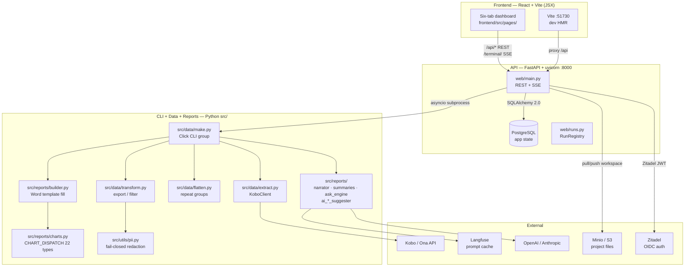
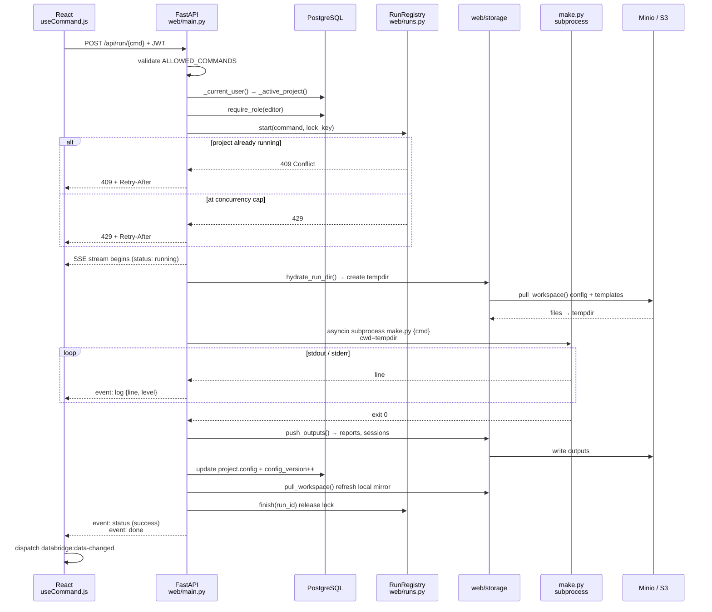
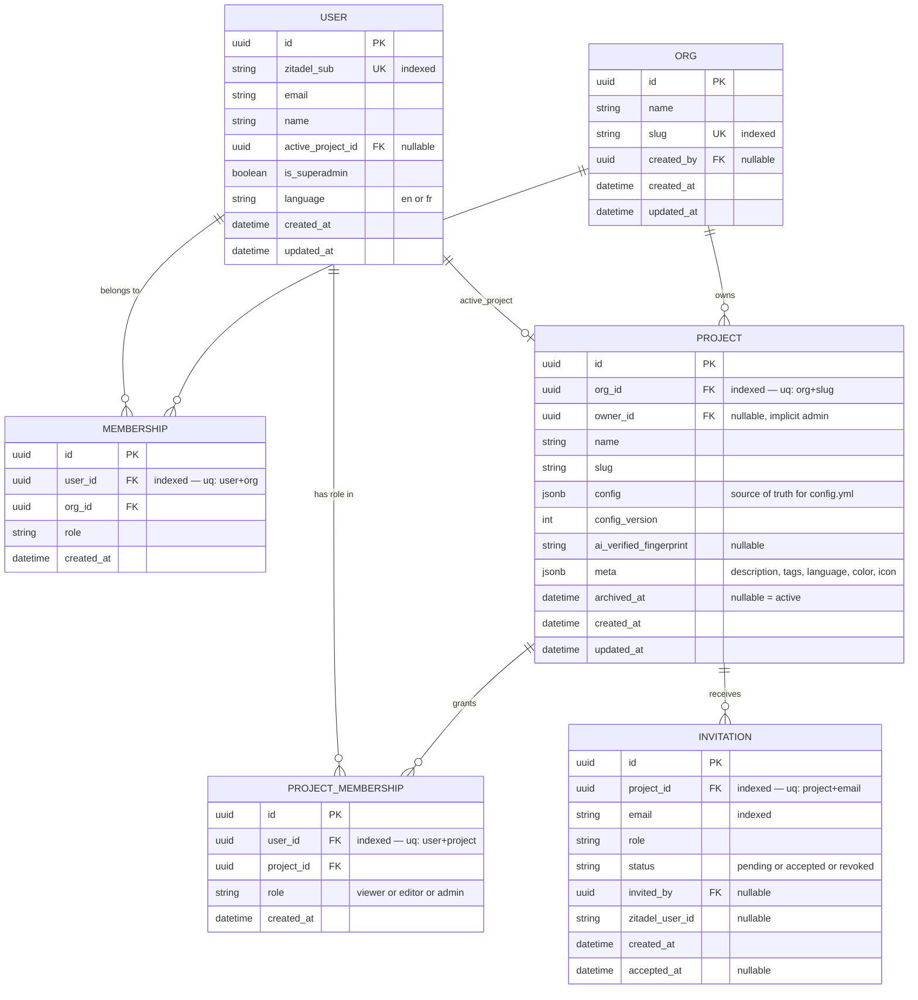

# Architecture — databridge-cli (kobo-reporter)

Code map for agents and developers. Kept in sync by the `docs` agent when source changes.
Prose architecture is in `CLAUDE.md`; field-by-field config reference in `docs/reference/`.

---

## System overview

Three layers, two languages, one host. No Docker required to run.



**Dev mode:** `./scripts/dev.sh` — Vite `:51730` proxies `/api/*` → uvicorn `:8000` (hot reload on both).
**Prod mode:** `./scripts/serve.sh` — uvicorn `:8000` serves the built bundle + API from one port.

---

## Request lifecycle — `POST /api/run/{command}` (SSE)



---

## Data model



**RBAC:** `ProjectMembership.role ∈ {viewer, editor, admin}`. `Project.owner_id` is implicit admin.
`User.is_superadmin` bypasses all membership checks. `require_role()` in `web/main.py` enforces tiers.

---

## Code map

### CLI entry points (`src/data/make.py`)

| Command | Function | What it does |
|---|---|---|
| `fetch-questions` | `cmd_fetch_questions` | Kobo API → merge into `config.yml questions:` |
| `download` | `cmd_download` | Fetch submissions → flatten → PII gate → `data/processed/` |
| `build-report` | `cmd_build_report` | Load processed data → render charts → fill Word template |
| `run-all` | `cmd_run_all` | Chain download → generate-template → build-report with fingerprint skip |
| `generate-template` | `cmd_generate_template` | Auto-build `.docx` template from config charts/indicators |
| `ai-generate-template` | `cmd_ai_generate_template` | LLM-generated template from a description |
| `infer-template` | `cmd_infer_template` | Detect placeholders in an uploaded `.docx` |
| `apply-template` | `cmd_apply_template` | Map detected placeholders → config fields |
| `set-period` | `cmd_set_period` | Write `periods.current` in `config.yml` |
| `push-prompts` | `cmd_push_prompts` | Seed prompts → Langfuse |
| `suggest-charts/views/summaries/tables/indicators` | `cmd_suggest_*` | AI suggestions for config sections |
| `list-sessions` | `cmd_list_sessions` | List data sessions in `data/processed/` |

All commands exposed at `POST /api/run/{command}` via `ALLOWED_COMMANDS` whitelist.

---

### API endpoints (`web/main.py`) — grouped

| Group | Key endpoints | Auth |
|---|---|---|
| **Config** | `GET/POST /api/config` · `GET /api/framework` · `GET/POST /api/pii` | editor (write) |
| **Projects** | `GET/POST /api/projects` · `PATCH/DELETE /api/projects/{id}` · `POST /api/projects/{id}/activate` | editor/admin |
| **Members** | `GET /api/projects/{id}/members` · `POST .../invite` · `PATCH/DELETE .../members/{uid}` | admin |
| **Run pipeline** | `POST /api/run/{command}` (SSE) · `GET /api/status` · `POST /api/stop` | editor |
| **Questions** | `GET/POST /api/questions` · `POST /api/questions/suggest-hidden` · `POST /api/questions/suggest-pii` | editor (write) |
| **Composition** | `POST /api/charts/preview` · `POST /api/indicators/preview` · `POST /api/summaries/preview` · `POST /api/views/preview` | editor |
| **AI** | `GET /api/ai/status` · `POST /api/ai/test` · `POST /api/ai/suggest` · `POST /api/ai/invalidate` | editor |
| **Ask** | `POST /api/ask` · `POST /api/ask/save` · `POST /api/ask/refine` · `GET /api/ask/examples` | editor |
| **Template** | `POST /api/template/infer` · `POST /api/template/apply` · `GET/POST /api/templates/*` | editor |
| **Data** | `GET /api/data` · `GET /api/data/sessions` · `GET /api/base-tables` · `GET /api/profile` · `GET /api/data-quality` | viewer |
| **Reports** | `GET /api/reports` · `GET /api/reports/download/{fn}` · `DELETE /api/reports/{fn}` | viewer/editor |
| **Periods** | `GET /api/periods` · `POST /api/periods/current` · `GET /api/periods/date-range` | editor |
| **Validate** | `POST /api/validate` | editor |
| **Admin** | `POST /api/admin/superadmins` | superadmin |

---

### Report pipeline call path

```
cmd_build_report()                       src/data/make.py:381
  └─ load_data()                         src/data/flatten.py
       └─ flatten submissions → base tables + repeat groups
  └─ apply_filters()                     src/data/transform.py
  └─ render_charts()                     src/reports/builder.py
       └─ CHART_DISPATCH[type](df, ...)  src/reports/charts.py:706
            → PNG saved to data/processed/charts/<name>.png
  └─ narrator.generate_summary()         src/reports/narrator.py
       └─ lf_client.get_prompt("narrator")
       └─ lf_client.chat()              → LLM → summary text
  └─ summaries.build_summaries()         src/reports/summaries.py
  └─ fill_template(doc, context)         src/reports/builder.py
       └─ docxtpl.DocxTemplate.render()  → {{ chart_N }}, {{ ind_name }}, etc.
  └─ output → reports/<filename>.docx
```

---

### Chart dispatch (`src/reports/charts.py:706`)

22 types in `CHART_DISPATCH`. All share signature `fn(df, questions, title, out_path, opts)`.

`bar` · `horizontal_bar` · `stacked_bar` · `grouped_bar` · `pie` · `donut` · `line` · `area` ·
`histogram` · `scatter` · `box_plot` · `heatmap` · `treemap` · `waterfall` · `funnel` · `table` ·
`bullet_chart` · `likert` · `scorecard` · `pyramid` · `dot_map` · `period_bar` · `period_line`

---

### AI / Prompt sites

Resolution order: **in-process cache** → **Langfuse** (HTTPS) → **bundled seeds** (`src/utils/seed_prompts.py`).

| Prompt name | Called from | Purpose |
|---|---|---|
| `narrator` | `src/reports/narrator.py` | Executive summary for the report |
| `summaries` | `src/reports/summaries.py` | Per-section narrative summaries |
| `chart_suggester` | `src/reports/ai_chart_suggester.py` | Suggest chart configs from questions |
| `indicator_suggester` | `src/reports/ai_indicator_suggester.py` | Suggest indicators |
| `summary_suggester` | `src/reports/ai_summary_suggester.py` | Suggest summary sections |
| `view_suggester` | `src/reports/ai_view_suggester.py` | Suggest view configs |
| `table_suggester` | `src/reports/ai_table_suggester.py` | Suggest table configs |
| `classifier_*` | `src/data/classifier.py` | Open-text classification |
| `ask_*` | `src/reports/ask_engine.py` | NL question answering (recipe + narrative) |
| `template_inference` | `src/reports/template_inference.py` | Detect placeholder intent in uploaded .docx |
| `ai_hidden_suggester` | `src/reports/ai_hidden_suggester.py` | Suggest hidden questions |
| `ai_pii_suggester` | `src/reports/ai_pii_suggester.py` | Suggest PII columns |

---

### Frontend pages → primary API

| Page | File | Key endpoints |
|---|---|---|
| Dashboard | `Home.jsx` | `GET /api/config` · `GET /api/state` · `GET /api/ai/status` |
| Sources (①) | `Sources.jsx` | `POST /api/run/download` · `GET /api/data/sessions` · `POST /api/sources/test` |
| Questions (②) | `Questions.jsx` | `GET/POST /api/questions` · `POST /api/questions/suggest-*` |
| Composition (③) | `Composition.jsx` | `POST /api/charts/preview` · `POST /api/indicators/preview` · `POST /api/ai/suggest` |
| Reports (④) | `Reports.jsx` | `POST /api/run/build-report` · `GET /api/reports` · `POST /api/template/infer` |
| Templates | `Templates.jsx` | `GET/POST /api/templates/*` · `POST /api/template/apply` |
| Validate | `Validate.jsx` | `POST /api/validate` · `GET /api/profile` |
| Ask | `Ask.jsx` | `POST /api/ask` · `POST /api/ask/save` · `POST /api/ask/refine` |

SSE runs consumed by `frontend/src/hooks/useCommand.js` via `fetch().body.getReader()`.

---

### Key symbols — where to find them

| Symbol | File | Line |
|---|---|---|
| `CHART_DISPATCH` | `src/reports/charts.py` | 706 |
| `ALLOWED_COMMANDS` | `web/main.py` | 535 |
| `require_role()` | `web/main.py` | ~150 |
| `_active_project()` | `web/main.py` | ~500 |
| `enforce_pii()` | `src/utils/pii.py` | top-level fn |
| `hydrate_run_dir()` | `web/main.py` | ~1800 |
| `push_outputs()` | `web/main.py` | ~1860 |
| `RunRegistry` | `web/runs.py` | 38 |
| `load_data()` | `src/data/flatten.py` | top-level fn |
| `export_data()` | `src/data/transform.py` | top-level fn |
| `lf_client.get_prompt()` | `src/utils/lf_client.py` | top-level fn |
| `env:` resolution | `src/utils/config.py` | `load_config()` |
| `Base` (ORM) | `web/db/models.py` | 15 |
| `get_project_for_user()` | `web/db/repository.py` | — |
| `useCommand` | `frontend/src/hooks/useCommand.js` | — |
| `ConfigContext` | `frontend/src/lib/` | — |

---

### Storage layout (per project)

```
Minio / S3
└─ <org_slug>/<project_slug>/
   ├─ config.yml              ← mirrored from project.config on activate/save
   ├─ data/sessions/          ← downloaded submission bundles (raw + processed)
   ├─ reports/                ← generated .docx outputs
   └─ templates/              ← uploaded + generated Word templates

Local (materialised mirror of active project)
├─ config.yml
├─ data/
│   ├─ raw/                  ← not synced (regenerable)
│   └─ processed/
│       └─ charts/           ← not synced (regenerable)
├─ reports/
└─ templates/
```
